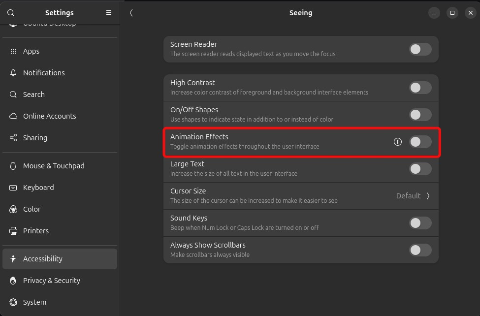

# Activity Logger


Makes a timelapse of your work every single day. Saves this timelapse as a video along with some summary information as in JSON and CSV formats. 

Currently only works on debian-based linux.

## Installation

Simply copy and paste the below command in a terminal.

```
wget https://github.com/BobbyDusk/activity-logger/archive/refs/tags/v1.0.0.tar.gz -O activity-logger.tar.gz &&
tar -xzf activity-logger.tar.gz &&
rm activity-logger.tar.gz &&
cd activity-logger-1.0.0 &&
bash setup.sh &&
cd .. &&
rm -rf activity-logger-1.0.0
```

## How to use

All the generated files (mp4, json and csv) can be accessed in `<home directory>/activity_logger`. Every file is named `YYYY-MM-DD_<day of week>.<extension>`, e.g. `2025-02-18_Tuesday.mp4`. When you start your computer for the first time in the day, it generates these files for the previous day.

## Note

On gnome-wayland a flash appears whenever a screenshot is taken. You can disable this by disabling animations in the accessibility settings (settings -> accessibility -> seeing -> Animation Effects).



## Stack

- python
- systemd
- uv

## TODO

- automatic backups

## TODO (done)

- detect completely black screens and remove them, since those indicate when computer was sleeping, so should be treated as stop
- On start/stop cards, also mention how much time since last start/stop
- For every day, also have a json file with a summary of
  - start/stop times (both in real life as well as video timestamp)
  - total time on computer
- csv file for every day with blocks
- Add chapters for start-stop see [here](https://medium.com/@dathanbennett/adding-chapters-to-an-mp4-file-using-ffmpeg-5e43df269687) and [here](https://ikyle.me/blog/2020/add-mp4-chapters-ffmpeg)


